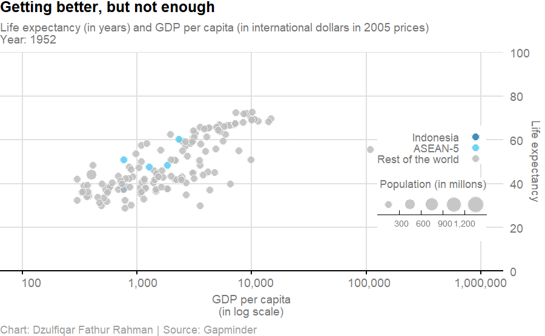

```{r Setup, include=FALSE}
knitr::opts_chunk$set(echo = FALSE)
```

I created dozens of data visualizations on various topics in 2020 both for work and personal projects. From COVID-19 to industrial park. 

I published my first [“data-driven story” on poverty in Jakarta](https://www.thejakartapost.com/news/2020/02/06/jakarta-poverty-rate-drops-to-third-lowest-level-since-reformasi.html){target=”_blank”} on The Jakarta Post in February last year. Aside from analyzing data and creating visualizations for work, I also do it outside work, mostly for learning. I usually publish the result on my Twitter account.

Here’s my favorite data visualizations from last year, with a few improvements.

```{r Styles}
library(htmltools)
library(stringr)

add_section <- function(publication, url, date) {
  
  publication_lower <- str_to_lower(publication)
  
  color <- if (publication_lower == "twitter") {
    "#1DA1F2"
  } else {
    # The Jakarta Post
    "#e01e26"
  }
  
  section <- tags$div(
    tags$b(
      tags$a(
        href = url, 
        style = paste0("color:", color),
        publication
      )
    ),
    br(),
    tags$p(style = "color:#999", date)
  )
  
  return(section)
  
}
```

```{r Charts on COVID deahts}
add_section(
  publication = "Twitter",
  url = "https://twitter.com/dzulfiqarfr/status/1274197957349273600?s=20",
  date = "June 20, 2020"
)
```

<iframe title="Deaths tend to be higher in densely-populated regions" aria-label="chart" id="datawrapper-chart-2poIL" src="https://datawrapper.dwcdn.net/2poIL/1/" scrolling="no" frameborder="0" style="width: 0; min-width: 100% !important; border: none;" height="371"></iframe><script type="text/javascript">!function(){"use strict";window.addEventListener("message",(function(e){if(void 0!==e.data["datawrapper-height"]){var t=document.querySelectorAll("iframe");for(var a in e.data["datawrapper-height"])for(var r=0;r<t.length;r++){if(t[r].contentWindow===e.source)t[r].style.height=e.data["datawrapper-height"][a]+"px"}}}))}();
</script>

```{r Map of Batang industrial estate}
add_section(
  publication = "The Jakarta Post",
  url = "https://www.thejakartapost.com/news/2020/07/14/what-you-need-to-know-about-batang-industrial-zone-development.html",
  date = "July 17, 2020"
)
```

<iframe title="To be made in Batang and Brebes" aria-label="chart" id="datawrapper-chart-q0iOk" src="https://datawrapper.dwcdn.net/q0iOk/4/" scrolling="no" frameborder="0" style="width: 0; min-width: 100% !important; border: none;" height="573"></iframe><script type="text/javascript">!function(){"use strict";window.addEventListener("message",(function(a){if(void 0!==a.data["datawrapper-height"])for(var e in a.data["datawrapper-height"]){var t=document.getElementById("datawrapper-chart-"+e)||document.querySelector("iframe[src*='"+e+"']");t&&(t.style.height=a.data["datawrapper-height"][e]+"px")}}))}();
</script>

```{r Table on COVID cases}
add_section(
  publication = "Twitter",
  url = "https://twitter.com/dzulfiqarfr/status/1284729684643676160?s=20",
  date = "July 19, 2020"
)
```

<iframe title="Pandemic development" aria-label="table" id="datawrapper-chart-yTEY3" src="https://datawrapper.dwcdn.net/yTEY3/1/" scrolling="no" frameborder="0" style="width: 0; min-width: 100% !important; border: none;" height="391"></iframe><script type="text/javascript">!function(){"use strict";window.addEventListener("message",(function(e){if(void 0!==e.data["datawrapper-height"]){var t=document.querySelectorAll("iframe");for(var a in e.data["datawrapper-height"])for(var r=0;r<t.length;r++){if(t[r].contentWindow===e.source)t[r].style.height=e.data["datawrapper-height"][a]+"px"}}}))}();
</script>

```{r Alt text for animated scatter plot on GDP per capita and life expectancy}
alt_text <- "An animated scatter plot of GDP per capita in international dollars in 2005 prices and life expectancy between 1952 and 2007. The chart shows the population of each country as circle size. The chart highlights Indonesia and ASEAN-5, while also showing the rest of the world. The animated chart shows that the countries had achieved substantial progress in improving well-being"
```

```{r Chart on GDP per capita and life expectancy, fig.alt=alt_text}
add_section(
  publication = "Twitter",
  url = "https://twitter.com/dzulfiqarfr/status/1303562408410062849?s=20",
  date = "Sep. 9, 2020"
)


```

```{r Code for animated scatter plot, eval=FALSE, echo = TRUE, code_folding=TRUE}
# Packages ----------------------------------------------------------------

library(tidyverse)
library(gapminder)
library(gganimate)

# Data --------------------------------------------------------------------

asean_5 <- c("Singapore", "Philippines", "Thailand", "Malaysia")

gapminder_grouped <- gapminder %>% 
  mutate(
    pop = pop / 1000000,
    group = case_when(
      country == "Indonesia" ~ "Indonesia",
      country %in% asean_5 ~ "ASEAN-5",
      TRUE ~ "Rest of the world"
    )
  )

# Chart -------------------------------------------------------------------

x_axis_break <- c(100, 1000, 10000, 100000, 1000000)

color_primary <- "#757575"
color_primary_light <- "#E0E0E0"

gapminder_chart <- ggplot(gapminder_grouped, aes(gdpPercap, lifeExp)) +
  geom_point(
    aes(fill = group, size = pop),
    pch = 21, 
    color = "white", 
    alpha = 0.85
  ) +
  scale_x_log10(
    breaks = x_axis_break,
    labels = format(x_axis_break, scientific = FALSE, big.mark = ","),
    limits = c(100, 1000000)
  ) +
  scale_y_continuous(
    breaks = seq(0, 100, 20),
    limits = c(0, 100),
    expand = c(0, 0),
    position = "right"
  ) +
  scale_fill_manual(
    values = c(
      "Indonesia" = "#2477B3",
      "ASEAN-5" = "#55CBF2",
      "Rest of the world" = "#BDBDBD"
    )
  ) +
  scale_size_binned(
    name = "Population (in millons)",
    breaks = seq(0, 1500, 300),
    limits = c(0, 1500),
    labels = format(seq(0, 1500, 300), scientific = FALSE, big.mark = ",")
  ) +
  guides(
    fill = guide_legend(
      title = NULL, 
      label.position = "left",
      label.hjust = 1,
      override.aes = list(size = 2.5)
    ),
    size = guide_bins(
      title.position = "top",
      title.hjust = 1,
      label.theme = element_text(size = 6.6, color = color_primary),
      direction = "horizontal",
      override.aes = list(fill = "#BDBDBD")
    )
  ) +
  labs(
    title = "Getting better, but not enough",
    subtitle = paste0(
      "Life expectancy (in years) and GDP per capita (in international dollars in 2005 prices)",
      "\nYear: {frame_time}"    
    ),
    x = "GDP per capita\n(in log scale)",
    y = "Life expectancy",
    caption = "Chart: Dzulfiqar Fathur Rahman | Source: Gapminder"
  ) +
  theme(
    text = element_text(size = 12, color = color_primary),
    axis.title = element_text(size = rel(0.75)),
    axis.text = element_text(size = rel(0.75), color = color_primary),
    axis.line.x = element_line(color = "black"),
    axis.ticks.x = element_line(color = "black"),
    axis.ticks.y = element_blank(),
    panel.background = element_rect(fill = "#FFFFFF"),
    panel.grid.major.x  = element_line(color = color_primary_light),
    panel.grid.major.y = element_line(color = color_primary_light),
    panel.grid.minor = element_blank(),
    plot.title = element_text(
      face = "bold", 
      size = rel(1),
      color = "black", 
      margin = margin(b = 5)
    ),
    plot.subtitle = element_text(
      size = rel(0.75), 
      color = color_primary, 
      margin = margin(b = 5)
    ),
    plot.title.position = "plot",
    plot.caption = element_text(
      size = rel(0.7),
      color = "#9E9E9E",
      hjust = 0,
      margin = margin(t = 5)
    ),
    plot.caption.position = "plot",
    legend.margin = margin(0, unit = "mm"),
    legend.title = element_text(size = rel(0.7)),
    legend.text = element_text(size = rel(0.7)),
    legend.key = element_blank(),
    legend.key.height = unit(0.35, "mm"),
    legend.position = c(0.75, 0.4),
    legend.justification = "left",
    plot.margin = margin(0, unit = "mm")
  )

gapminder_animated <- gapminder_chart +
  transition_time(year) +
  ease_aes()

anim_save(
  "gapminder_animated.gif",
  animation = gapminder_animated,
  width = 6,
  height = 3.708,
  units = "in",
  res = 150
)
```

