```{r setup, include=FALSE}
# Packages
library(knitr)

# Global chunk options
opts_chunk$set(
  echo = FALSE, 
  fig.align = "center", 
  out.width = "100%"
)
```


Do you know that The Jakarta Post (JakPost) has been publishing data-driven stories? JakPost did not have a data journalism desk or section on the website and the newspaper. But my colleagues and I had been wrangling data to find stories.

This post compiles the data visualizations from my 14 selected stories between mid-2021 and March 2022. Since there was no data journalism desk, I worked on these stories with the business desk. So my stories are largely related to the impact of COVID-19 on livelihoods.

When working on these stories, I was still learning and trying to figure out some stuff. (Actually, I still do.) Writing this post, therefore, has allowed me to not just look back at what I've achieved, but also see what I could have done better. As a result, I recreated the charts and map with a couple improvements where necessary.

You can find the code and data behind these visualizations in [this GitHub repository](https://github.com/dzulfiqarfr/jakpost-graphics). The repo also tells you the changes I've made to them.

Enjoy!


## Indonesia remains Java-centric despite Jokowi's infrastructure campaign

May 23, 2021

Read the story on [this link](https://www.thejakartapost.com/news/2021/05/23/indonesia-remains-java-centric-despite-jokowis-infrastructure-campaign.html).

The first chart in this story shows that population and economic development had remained too concentrated in Java between 1971 and 2020.

```{r, fig.alt="A stacked-column chart with two panels. The left-hand panel shows the share of population by island group between 1971 and 2020 based on data from Statistics Indonesia (BPS). The left-hand panel shows that Java still accounted for over half of the population in 2020. The population share of the island was lower than in 1971, but the decline was sluggish. The right-hand panel shows the distribution of real gross domestic product (GDP) between 2010 and 2020. The right-hand panel reveals that Java also accounted for more than half of the GDP over the period."}
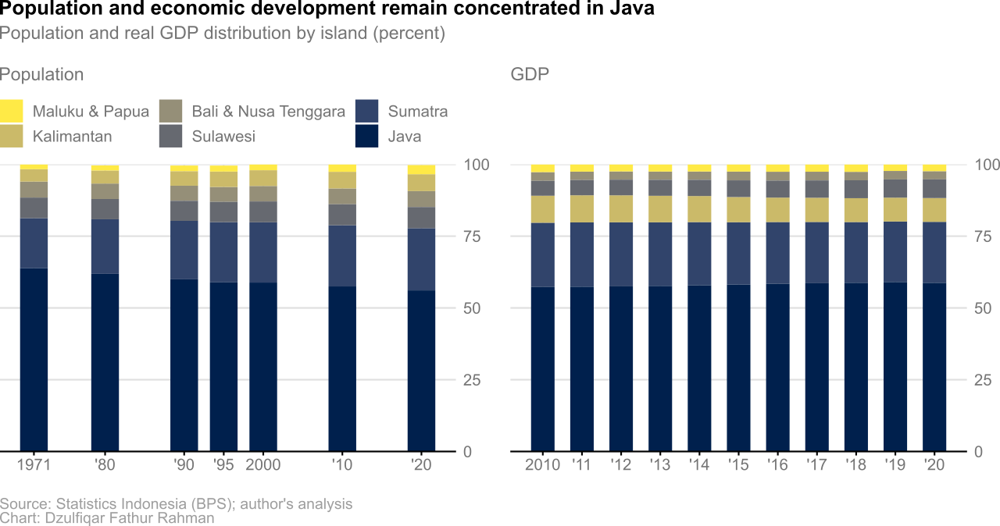
```

The second chart shows that provinces with a higher per capita income tended to have more incoming lifetime migrants relative to their population. 

```{r, fig.alt="A scatter plot based on data from BPS. The x-axis plots real gross regional domestic product (GRDP) per capita in 2020 by province. The y-axis plots incoming lifetime migrants relative to population in 2019 by province. The chart shows that provinces with a higher GRDP per capita tended to have a larger share of incoming lifetime migrants. Riau Islands, for example, had Rp 84.74 million income per head and lifetime migrants that accounted for 46.4 percent of the population."}
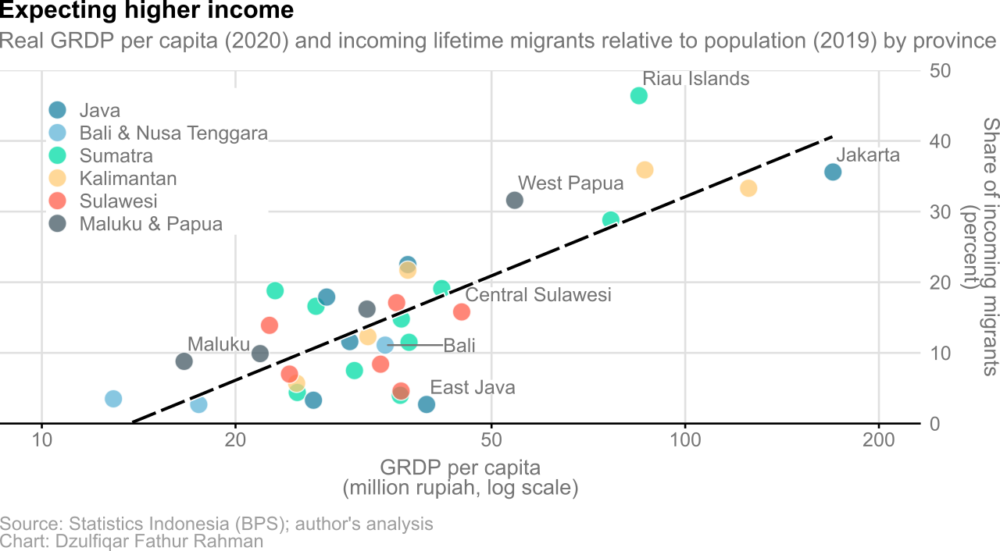
```

The following map shows that lifetime migrants also tended to choose neighboring provinces or the ones closest to their home.

```{r, fig.alt="A choropleth map with a red-to-blue diverging scale that shows net lifetime migration relative to population in 2019 based on data from BPS. The map shows that lifetime migrants tended to choose neighboring provinces or the ones closes to their home."}
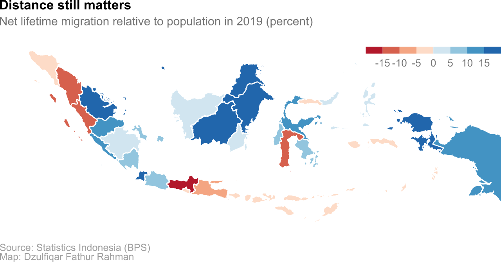
```


## COVID-19 takes severe toll on wages

June 14, 2021

Read the story on [this link](https://www.thejakartapost.com/news/2021/06/14/covid-19-takes-severe-toll-on-wages.html).

The first chart in this story shows that the average net wage in real terms declined in August 2020 from a year earlier, while the unemployment rate rose sharply to a level not seen at least in the past four years.

```{r, fig.alt="A line chart with two panels based on data from BPS, the World Bank and my analysis. The left-hand panel shows that the average net wage at 2010 prices was down 7.18 percent in August 2020 from a year earlier. This left-hand panel also shows that wage had been growing at a sluggish pace, if not contracting, since late 2017. The right-hand panel shows that the unemployment rate rose to 7.07 percent in August 2020, a level not seen at least in the past four years."}
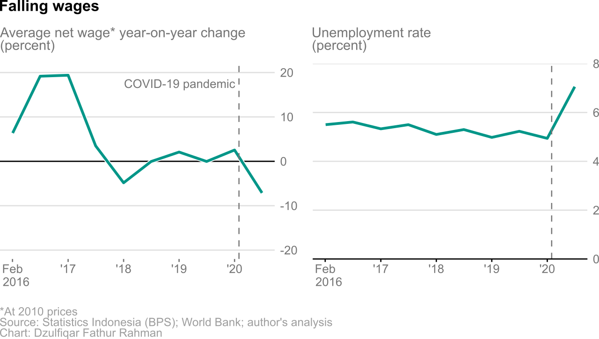
```

The second chart shows that sectors that fared better, such as information and communication, recorded a smaller decline in its real wage. Meanwhile, hard-hit sectors like transportation and storage recorded a steeper decline in its real wage.

```{r, fig.alt="A scatter plot based on data from BPS, the World Bank and my analysis. The x-axis plots the annual change in gross value added in 2020 by sector. The y-axis plots the annual change in the average net wage in 2020 by sector. All data are at 2010 prices. The chart shows wages fell steeper in sectors that fared worse, such as acommodation and food service activities. In this sector, the wage fell by 18.69 percent as the output shrank by 10.26 percent."}
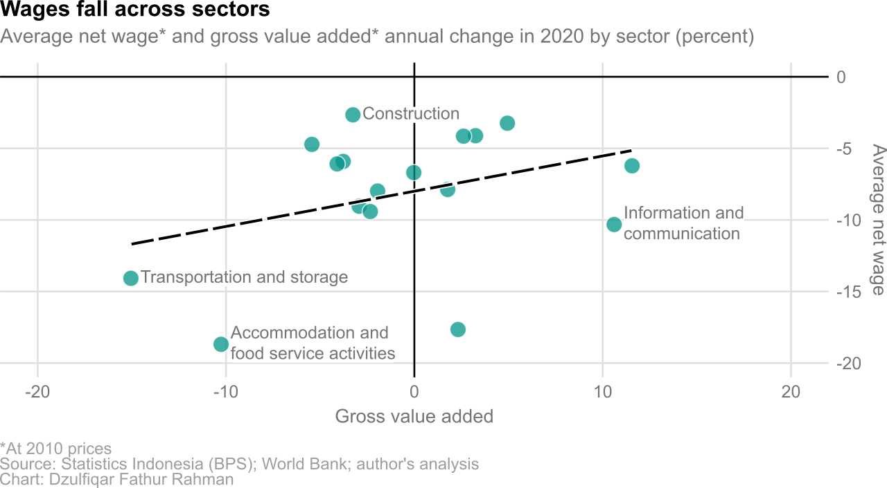
```

The next chart shows that while the average net wage in the majority of provinces stayed above the minimum wage in nominal terms, it fell to a level below the floor in Jakarta or even further below the floor in some provinces, such as West Sulawesi.

```{r, fig.alt="A dot plot with two panels that compares nominal average net wage and minimum wage between 2020 and 2021 by province based on data from BPS. The left-hand panel shows that wages in most provinces remained higher than the floor. The right-hand panel, however, shows that some provinces recorded wages below the floor, including Jakarta, where the average wage was Rp 4.11 million and the floor was Rp 4.41 million."}
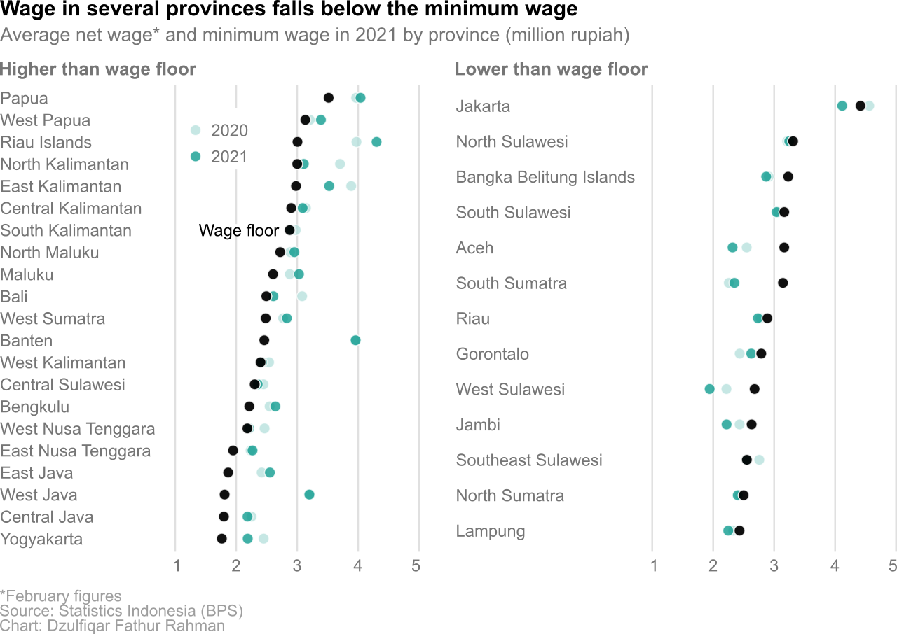
```


## Indonesian homeownership slides as affordability issues arise

June 28, 2021

Read the story on [this link](https://www.thejakartapost.com/news/2021/06/28/indonesian-homeownership-slides-as-affordability-issues-arise.html).

The first chart in this story shows that homeownership slightly fell between 1999 and 2020 in general. Bali and Jakarta recorded a significant decline, while Bengkulu and Jambi recorded a small increase in homeownership.

```{r, fig.alt="A chart with two panels on homeownership based on data from BPS. The left-hand panel is a line chart that plots the share of households with a home of their own between 1999 and 2020, indexed to 1999. The left-hand panel shows that homeownership at the national level fell by over 5 points and in Jakarta fell sharply by over 30 points. The right-hand panel is a bar chart that plots the bottom 10 provinces in terms of homeownership in 2020. It shows that homeownership in Jakarta was the lowest at 45 percent."}
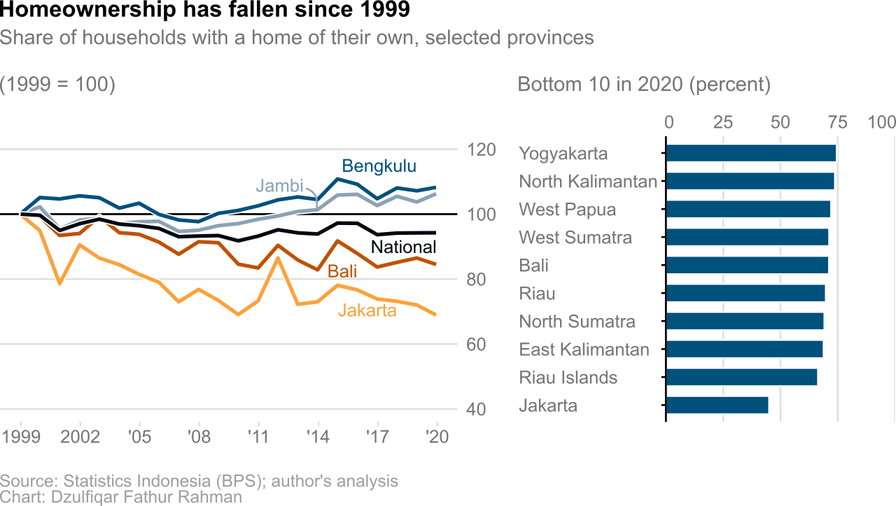
```

The next chart shows that house prices had been growing at a slower pace at least since 2014. In Bandar Lampung, Lampung, house prices declined during the pandemic.

```{r, fig.alt="A line chart that plots the residential property price index (or IHPR) between the January to March period in 2012 and the April to June period in 2021 by city based on data from Bank Indonesia (BI). The chart shows that house prices had been growing at a slower pace at least since 2014 at the national level."}
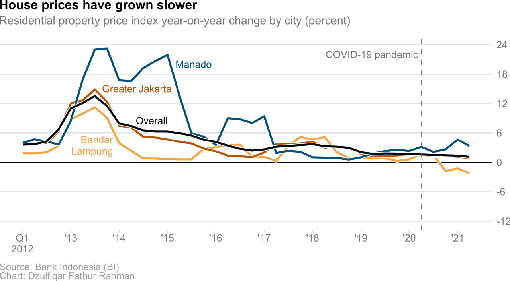
```

The next chart shows that the average monthly mortgage payment in Jakarta and Yogyakarta was unusually high in 2019, given the mortgage terms.

```{r, fig.alt="A scatter plot based on data from BPS. The x-axis plots the average mortgage payment per month in 2019 by province. The y-axis plots the average mortgage terms in 2019 by province. The chart shows that lower monthly mortgage payment is associated with longer mortgage terms. In Jakarta, however, the average payment was unusually high at Rp 6 million per month, while the mortgage terms averaged at 10.64 years."}
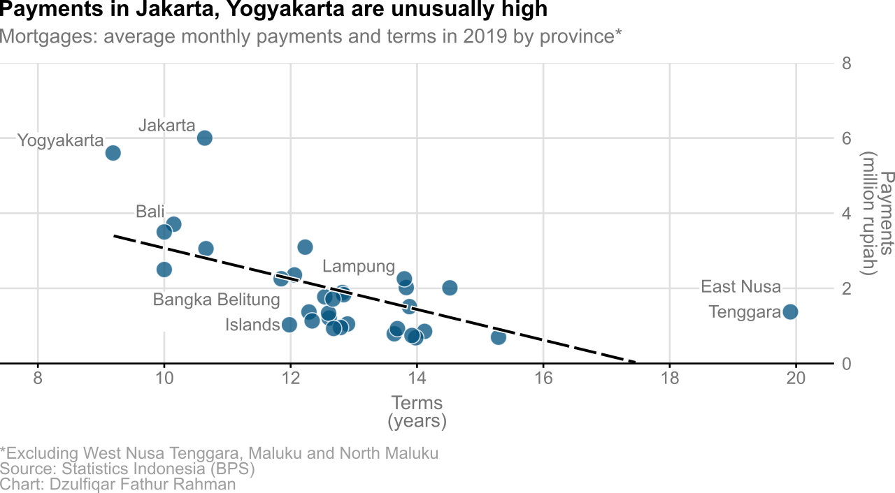
```


## Factory imports show recovery uncertainty

July 1, 2021

Read the story on [this link](https://www.thejakartapost.com/paper/2021/06/30/factory-imports-show-recovery-uncertainty.html).

This chart shows that imports of raw materials and capital goods had not shown a promising sign of recovery as of April 2021. While imports of raw materials continued to pick up pace, imports of capital goods did not.

```{r, fig.alt="A stacked-column chart with two panels based on imports data between January 2018 and April 2021 from BI and my analysis. The left-hand panel plots the contribution to the year-on-year growth of raw material imports by category. The left-hand panel shows that raw material imports, driven by industrial supplies and fuels, had been growing steadily up to April. The right-hand panel plots the same metric for capital goods imports. The right-hand panel shows that the capital goods imports had not shown a similar sign of recovery as it grew much slower in April than a month earlier."}
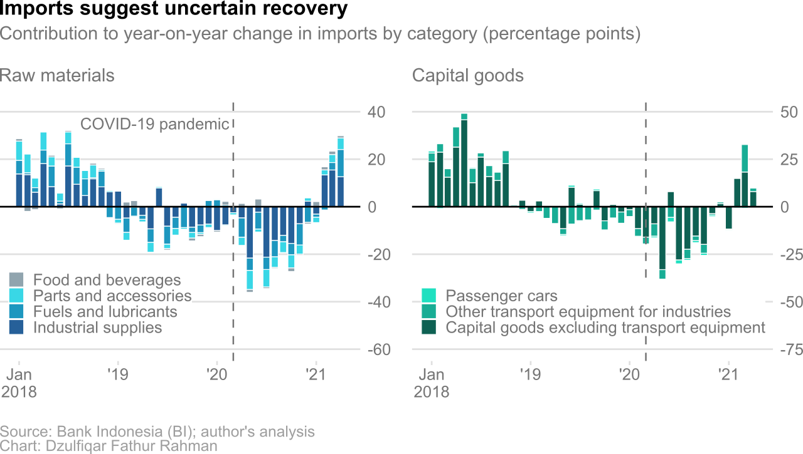
```


## Wealth gap narrows in Indonesia as stock market slumps, house prices grow

July 12, 2021

Read the story on [this link](https://www.thejakartapost.com/news/2021/07/12/wealth-gap-narrows-in-indonesia-as-stock-market-slumps-house-prices-grow.html).

The first chart in this story shows the estimated wealth distribution in Indonesia between 2019 and 2020. As the share of wealth of the bottom 40 percent slightly expanded while that of the richest 10 percent shrank, the wealth gap was estimated to narrow.

```{r, fig.alt="A line chart that plots the wealth distribution between 2019 and 2020 in Indonesia based on estimates from Credit Suisse and my analysis. The x-axis plots the cumulative share of adult population from poorest to wealthiest. The y-axis plots the cumulative share of wealth. The chart also includes a 45-degree diagonal line that reflects equal distribution of wealth. The area between the lines of wealth distribution and the diagonal line represents inequality. The chart shows that the wealth gap was estimated to have narrowed in 2020 as the share of wealth of the richet 10 percent declined. The area that represents inequality thus shrank as well."}
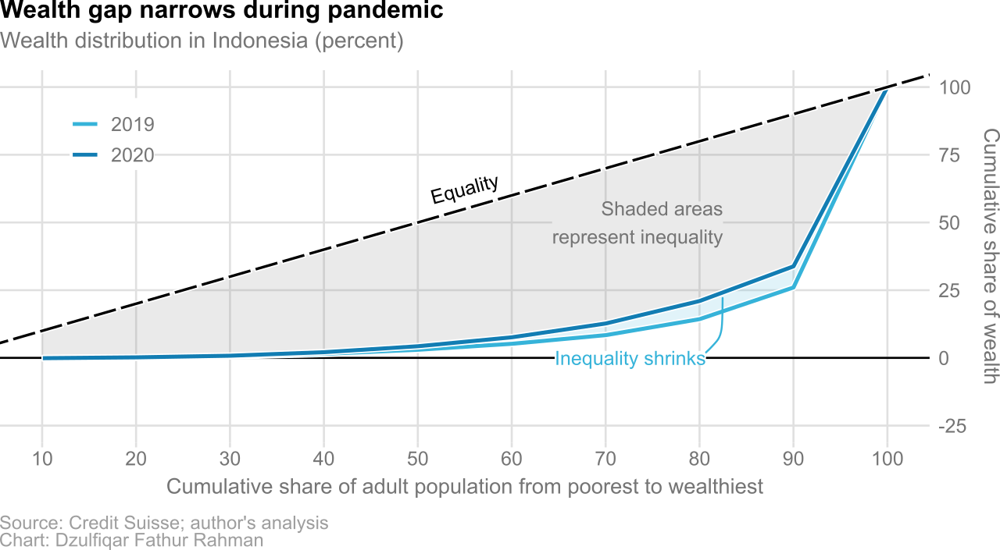
```

The second chart shows that wealth per adult in Indonesia continued to grow despite at a slower pace during the pandemic. The growth hinged largely on nonfinancial assets like houses.

```{r, fig.alt="A stacked-column chart that plots the contribution to year-on-year growth in net wealth per adult by asset between 2001 and 2020 based on estimates from Credit Suisse and my analysis. The chart shows that wealth still grew during the pandemic in 2020, although at a much slower pace than a year earlier, driven by nonfinancial assets like houses."}
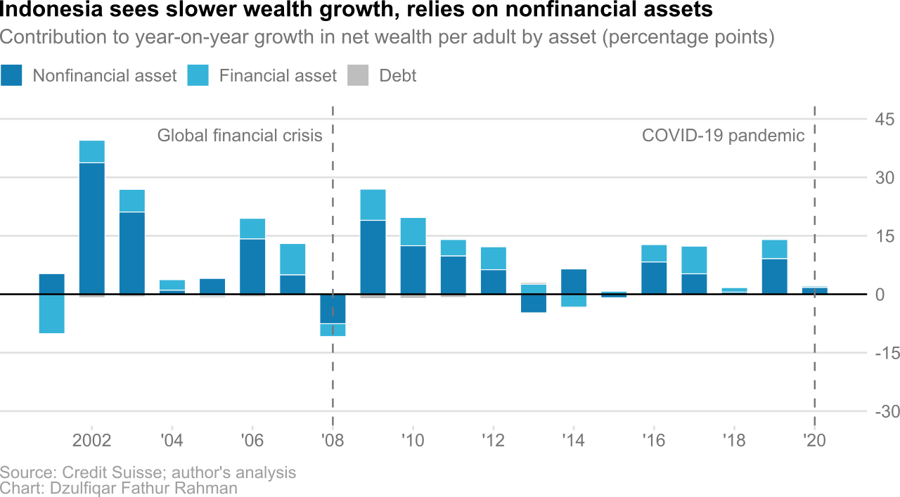
```


## Slow vaccination takes toll on Indonesia in uneven global recovery

August 1, 2021

Read the story on [this link](https://www.thejakartapost.com/news/2021/08/01/slow-vaccination-takes-toll-on-indonesia-in-uneven-global-recovery.html).

The first chart in this story shows that the International Monetary Fund (IMF) revised downward the 2021 economic growth forecast for Indonesia in its July outlook from the previous one. Indonesia joined other countries with a downward revision, such as India and neighboring Malaysia. 

```{r, fig.alt="A dot plot with two panels that charts the revision in economic growth forecast for 2021 for selected countries between the April and July outlook from the International Monetary Fund (IMF). The right-hand panel shows countries with upward revision and the left-hand panel countries with downward revision. Indonesia belongs to the group of countries with downward revision."}
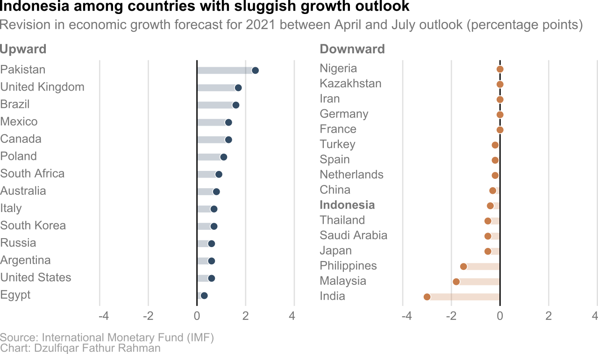
```

The second chart shows that Indonesia, like other low and lower-middle income countries, was falling behind its richer peers in inoculating its citizens against COVID-19. This trend is associated with the growth outlook.

```{r, fig.alt="A dot plot that shows the share of population vaccinated against COVID-19 at the latest date available for each country as of July 31, 2021, by income group based on data from Our World in Data (OWID) and the World Bank. The x-axis plots the income group and the y-axis the vaccination rate. The chart also includes dahsed lines representing the median vaccination rate of each income group. The chart shows that richer countries had vaccinated a larger share of their population than their low income peers. Indonesia, a low-middle income country, was also falling behind. This trend in vaccination by income group is correlated with the trend seen in the economic growth outlook."}
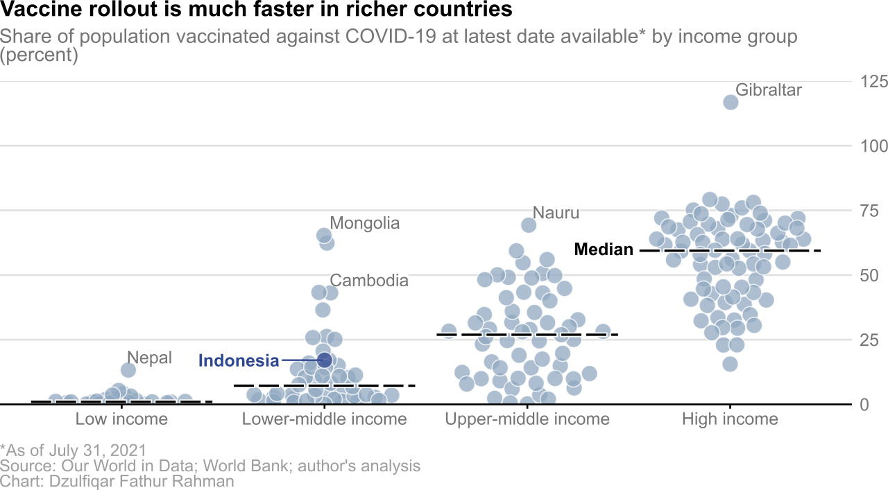
```


## Emergency curbs reverse recovery in consumer confidence, retail sales

August 12, 2021

Read the story on [this link](https://www.thejakartapost.com/news/2021/08/12/emergency-curbs-reverse-recovery-in-consumer-confidence-retail-sales.html).

The first chart in this story shows that the Delta wave, which peaked in July 2021, interrupted the recovery in consumer confidence and retail sales. The consumer confidence index fell back to a level nearly as pessimistic as in October 2020. The retail sales index also contracted again compared with a year earlier.

```{r, fig.alt="A line chart with two panels based on data from BI. The left-hand panel plots the consumer confidence index (CCI) between January 2017 and July 2021. The left-hand panel shows that the CCI fell in July to nearly 80, a level almost as pessimistic as in October 2020, as a result of the Delta wave of COVID-19 and the emergency curbs. The right-hand panel plots the retail sales index (RSI) over the same period. The RSI contracted again in July, but not as deep as during the first large-scale social restrictions in 2020, in part thanks to the base effect. This chart shows that the Delta wave and the emergency curbs reversed the recovery among consumers and retailers seen in both indicators."}
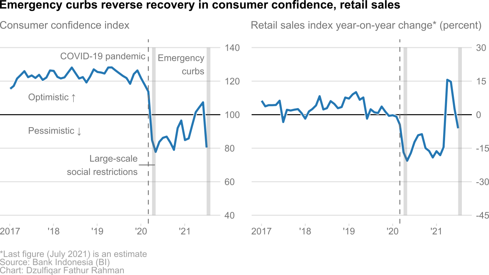
```

The next chart shows that visitors to retail and recreation places started declining in June, even before the government tightened mobility restrictions as cases surged, especially in Java and Bali.

```{r, fig.alt="A chart with two panels based on data from Google, the COVID-19 task force, BPS and my analysis. The left-hand panel is a line chart that plots the change in visitors to retail and recreation places between March 2020 and August 2021 by region, weighted by population of each region and smoothed to seven-day moving averages. The right-hand panel is a scatter plot. The x-axis plots the cumulative confirmed COVID-19 cases per 1 million people by province on a log scale. The y-axis plots the mobility to retail and recreation places by province. Together, this chart shows that mobility to retail and recreation places had actually started falling in June, even before the government tightened restrictions in July as cases surged. Mobility in Java and Bali fell more sharply than in other regions."}
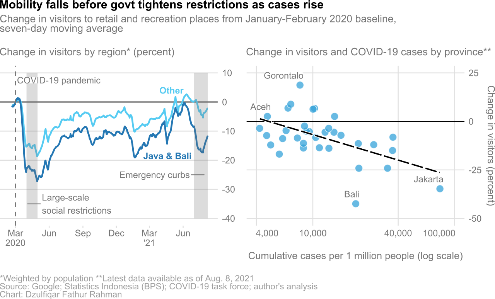
```


## Indonesia lags behind in decoupling economic and emission growth

September 5, 2021

Read the story on [this link](https://www.thejakartapost.com/news/2021/09/03/indonesia-lags-behind-in-decoupling-economic-and-emissions-growth.html).

The first chart in this story shows that Indonesia had not been able to grow its economy without slowing down both production and consumption-based CO2 emissions between 1990 and 2020. Meanwhile, other countries had managed to do so. Some countries, such as Singapore, developed their economy while reducing its emissions.

```{r, fig.alt="A line chart with four panels based on data from Our World in Data, the Global Carbon Project, United Nations (UN) and my analysis. The chart covers four countries, namely India, Indonesia, Singapore and the United States (US). Each panel shows data for each country. The chart plots real GDP per capita and production and consumption-based CO2 emissions per capita between 1990 and 2020, indexed to 1990. The chart shows that Indonesia was lagging behind the other three countries in decoupling economic growth from emission growth. Singapore and the US even managed to reduce their emission while developing their economy, respectively."}
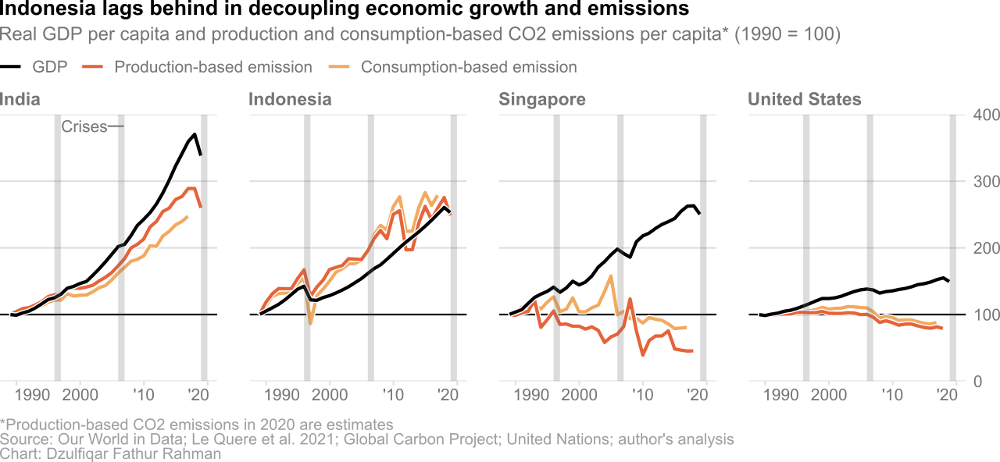
```

The following chart shows that Indonesia's human development index (HDI) might be below the threshold of high-human development if we accounted for emission and material footprint.

```{r, fig.alt="A line chart that plots the human development index (HDI) and planetary pressures-adjusted HDI (PHDI) between 1990 and 2019 based on data from the UN and my analysis. The chart shows that while the HDI stood in 2019 above the 0.7 threshold for high human development, the PHDI did not. This reflects that CO2 emission and material footprint, which together created the planetary pressure adjustment, discounted the country's human development progress."}
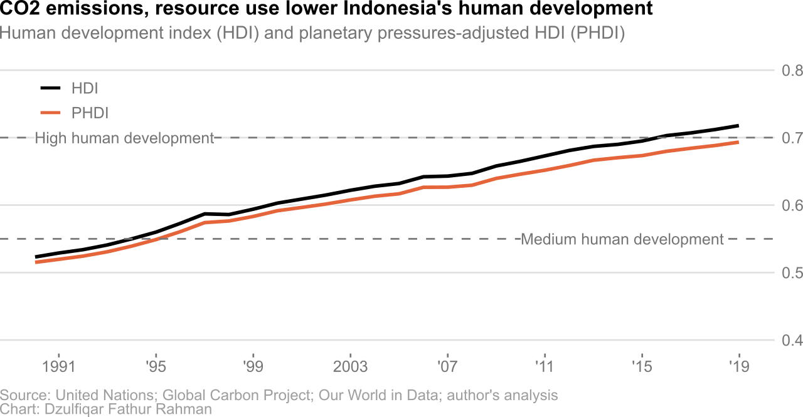
```


## Majority of affluent Indonesians plan to retire early

December 11, 2021

Read the story on [this link](https://www.thejakartapost.com/business/2021/12/10/majority-of-affluent-indonesians-plan-to-retire-early.html).

This chart shows that the share of affluent individuals planning to retire before turning 65 was highest in Indonesia among the surveyed countries. As a result, the share of these individuals who had not started saving or investing for retirement was very low in the country.

```{r, fig.alt="A dot plot with two panels based on 2021 survey data from Standard Chartered and my analysis. The left-hand panel plots the share of affluent individuals looking to retire before turning 65 by country. The left-hand panel shows that Indonesia had the highest share of such respondents at close to 60 percent. The right-hand panel plots the share of affluent individuals who haven't started saving or investing for retirement by country. The right-hand panel shows that Indonesia had the second-lowest of such respondets at less than 20 percent."}
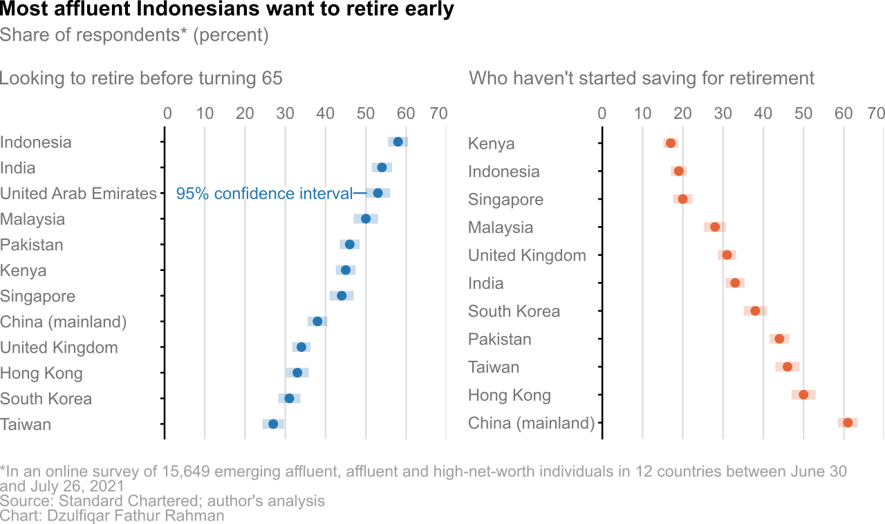
```


## Yearender 2021: How the Delta wave disrupted Indonesia's economic recovery

December 26, 2021

Read the story on [this link](https://www.thejakartapost.com/business/2021/12/25/year-ender-how-the-delta-wave-disrupted-indonesias-economic-recovery.html).

This chart shows how the Delta wave hit Indonesia when the rate of vaccination against the virus was still very low. This forced the government to tighten mobility restrictions. As a result, the country recorded a slower economic growth in the July to September period in 2021 than the previous quarter.

```{r, fig.alt="A chart with four panels based on data from OWID, Google, BPS and my analysis. The first panel plots the daily new confirmed COVID-19 cases smoothed to seven-day moving averages. The second panel plots the share of people fully vaccinated against coronavirus. The third panel plots the mobility to retail and recretaion places, workplaces and transit stations smoothed to seven-day moving averages. The fourth panel plots the year-on-year growth of real GDP. Together, this chart shows that the Delta wave disrupted the country's economic recovery because it peaked when the vaccination rate was very low at less than 10 percent, thus prompting the government to tighten mobility curbs."}
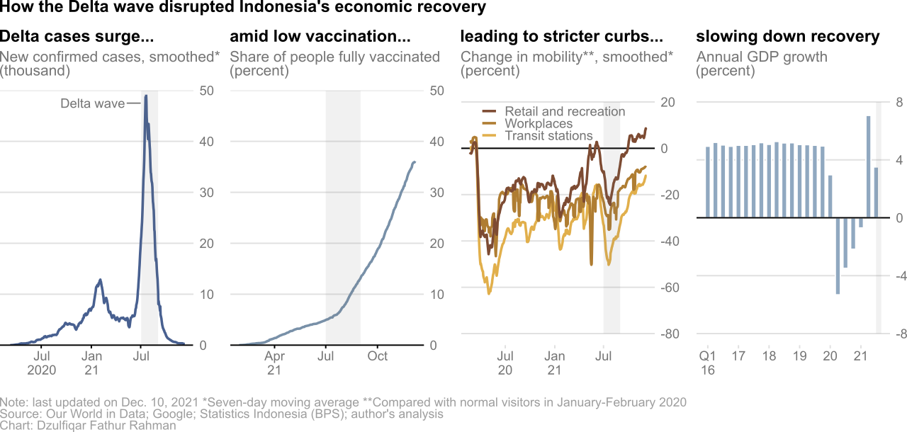
```


## How China beats US as trade, investment partner for Indonesia

January 4, 2022

Read the story on [this link](https://www.thejakartapost.com/business/2022/01/03/how-china-beats-us-as-trade-investment-partner-for-indonesia.html).

The first chart in this story shows that the share of Indonesia's exports to and imports from China started growing in early 2000s, following the latter's accession to the World Trade Organization (WTO). By late 2000s, the share of trade with China was larger than that with the United States (US).

```{r, fig.alt="A stacked-area chart with two panels based on trade data with China, the US and other countries between 1989 and 2020 from the UN and my analysis. The left-hand panel plots the share of Indonesia's goods exports. The right-hand panel plots the same metric for goods imports. Together, this chart shows that the proportion of exports to and imports from China started expanding rapidly since that country joined the World Trade Organization in 2001. China became Indonesia's largest trading partner by late 2000s, overtaking the US."}
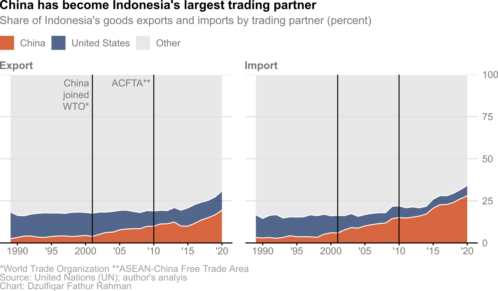
```

The next chart shows that net foreign direct investment (FDI) flow from China to Indonesia largely remained positive between 2010 and 2020. Meanwhile, the flow from the US showed a downward trend in general.

```{r, fig.alt="A line chart that plots the net foreign direct investment (FDI) flow to Indonesia from China and the US between 2010 and 2020 based on data from BI. The chart shows that the net FDI from China was largely on a positive trend, while that from the US was on a downward trend."}
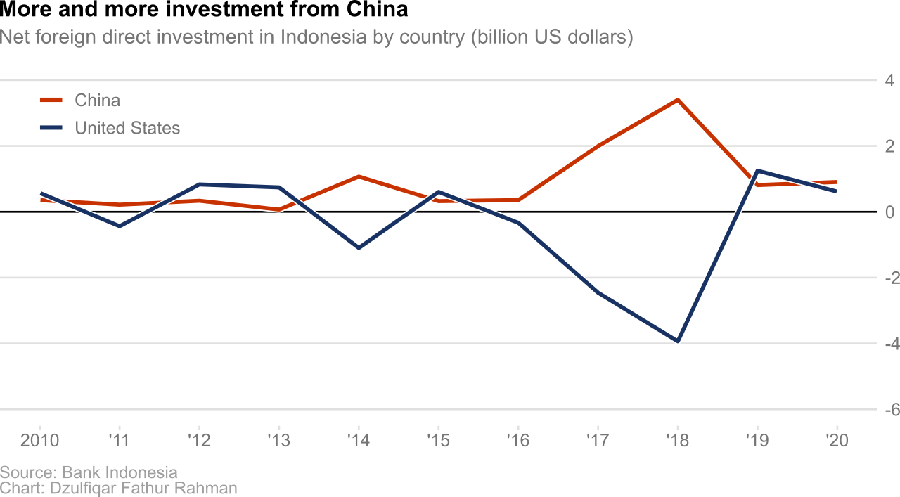
```


## Domestic travelers 'not enough' to revive Bali tourism

January 18, 2022

Read the story on [this link](https://www.thejakartapost.com/business/2022/01/18/domestic-travelers-not-enough-to-revive-bali-tourism.html).

This chart shows the large share of foreign guests at star-rated and other hotels in Bali in 2019. As a popular international tourist destination, the province was heavily dependent on foreign tourists.

```{r, fig.alt="A bar chart that plots the share of foreign guests at star-rated and other hotels in 2019 among top 10 provinces based on data from BPS and my analysis. The chart shows that foreign guests accounted for nearly 60 percent of the total in Bali. It is far higher than other provinces. This indicates the province's reliance on foreign tourists to revive its tourism-driven economy from the pandemic."}
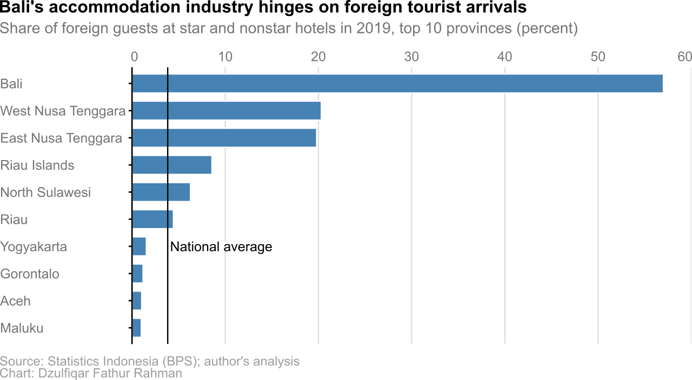
```


## COVID-19 expedites deindustrialization in Indonesia

February 9, 2022

Read the story on [this link](https://www.thejakartapost.com/business/2022/02/08/covid-19-expedites-deindustrialization-in-indonesia.html).

This chart shows the premature deindustrialization that started taking place in Indonesia in mid-2000s, as suggested by the share of manufacturing value added in real gross domestic product (GDP), and how the pandemic worsened it.

```{r, fig.alt="A line chart that plots the share of manufacturing value added in GDP at 2015 prices in US dollars between 1970 and 2020 based on data from the UN and my analysis. The chart shows that Indonesia had started seeing a premature deindustrialization at least since mid-2000s, when the share of manufacturing value added in GDP peaked at 23.68 percent and started declining steadily ever since. The COVID-19 pandemic worsened this trend."}
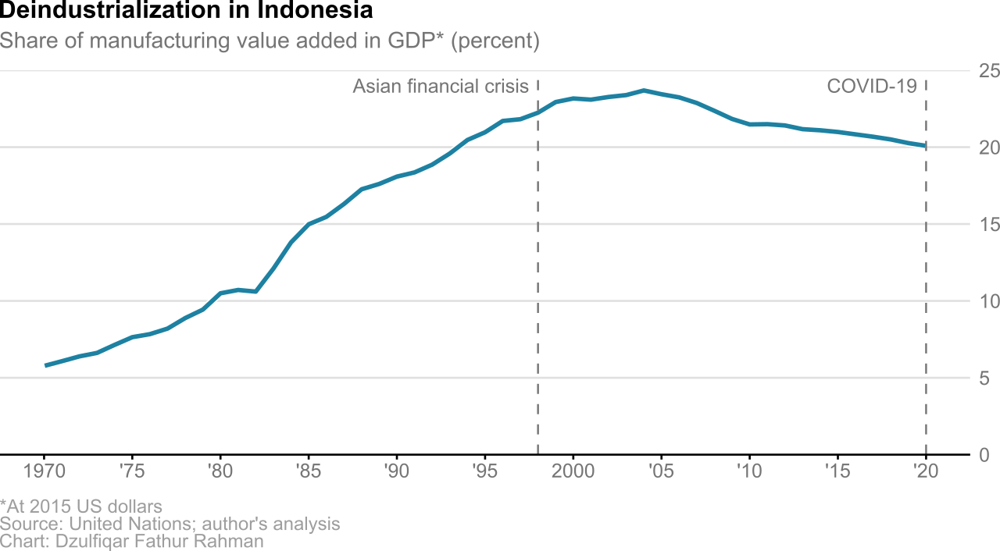
```


## COVID-19 pulls more workers into low-paying service sector jobs

March 5, 2022

Read the story on [this link](https://www.thejakartapost.com/business/2022/03/04/covid-19-pulls-more-workers-into-low-paying-service-sector-jobs.html).

This chart shows that most Indonesian workers in services had less than a college educational attainment in 2021. These workers were concentrated in traditional and low-paying sectors, such as accommodation and food service activities, transportation and storage, and wholesale and retail trade.

```{r, fig.alt="A stacked-bar chart that plots the distribution of workers in services by sector and educational attainment in 2021 based on data from BPS and my analysis. The chart shows that most workers in traditional service sectors, such as accommodation and food service activities, did not have a college degree. In the transportation and storage sector, for example, most workers were senior high school graduates."}
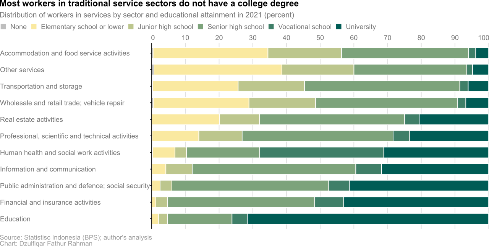
```

